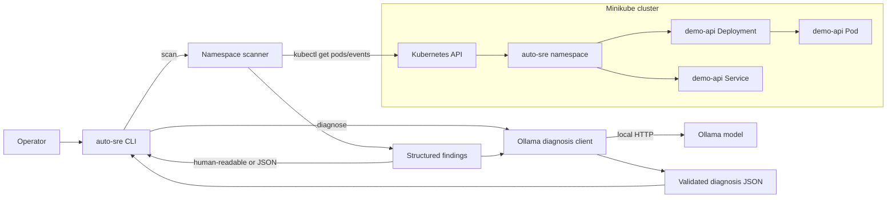

# Auto-SRE

Auto-SRE is a local Kubernetes reliability lab and operator. It uses Minikube to reproduce failures, collect evidence, diagnose incidents, and eventually apply guarded remediation.

## Current slice

The first vertical slice provides:

- A Minikube-ready `auto-sre` namespace with a demo Deployment and Service.
- A deterministic scanner for unhealthy Pods, container states, and Warning Events.
- A CLI with human-readable and JSON output.
- Unit tests for the scanner using Kubernetes API-shaped fixtures.

## Quickstart

```powershell
python -m venv .venv
.\.venv\Scripts\Activate.ps1
python -m pip install -e ".[dev]"
minikube start
kubectl apply -f deploy/demo.yaml
auto-sre scan --namespace auto-sre
pytest
```

A critical finding returns exit code `2`; a clean scan returns `0`; an unavailable cluster or invalid command returns `1`.

## Architecture



The scanner reads Kubernetes state through `kubectl` and never changes cluster resources. The diagnosis path sends scanner findings to Ollama on the local machine; the model cannot execute Kubernetes commands or perform remediation.

## Local Ollama diagnosis

Install Ollama for Windows from <https://ollama.com/download/windows>, then start it and pull the default model:

```powershell
ollama pull llama3.2:3b
auto-sre diagnose --namespace auto-sre --json
```

Use another local model or Ollama endpoint with environment variables:

```powershell
$env:OLLAMA_MODEL = "llama3.1:8b"
$env:OLLAMA_URL = "http://localhost:11434"
auto-sre diagnose --namespace auto-sre --json
```

The model receives scanner findings only and must return a validated JSON diagnosis. It cannot execute Kubernetes commands or perform remediation.

## Roadmap

The next slices add declarative failure scenarios, evidence normalization, incident correlation, diagnosis contracts, guarded remediation, and the operator dashboard. Supported failures will be tracked in a versioned taxonomy rather than treated as an unlimited claim.
